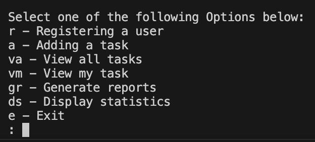
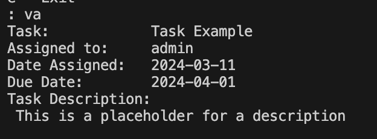

# Task Manager

## Description
The Task Manager is a Python-based project designed to help small businesses manage tasks assigned to each member of a team. It provides a simple and efficient way to organize, track, and manage tasks within a team.

## Table of Contents
- [Installation](#installation)
- [Usage](#usage)
- [Features](#features)
- [Credits](#credits)

## Installation
1. Clone the repository: git clone https://github.com/romirant/Code-Bootcamp-Projects.git
2. Navigate to the project directory: cd T14 - Capstone Project - Lists, Functions, and String Handling

## Usage
1. Run the `task_manager copy.py` file: python `task_manager copy.py`
2. Follow the on-screen menu options to interact with the Task Manager:
- Register a user
- Add a task
- View all tasks
- View tasks assigned to the current user
- Generate reports
- Display statistics

## Features
- User registration: Allows new users to be registered with the system.
- Task management: Enables adding, viewing, and managing tasks.
- User-specific tasks: Provides functionality to view tasks assigned to the current user.
- Task completion and editing: Allows users to mark tasks as complete or edit task details.
- Reporting: Generates reports on task and user statistics.
- Data persistence: Utilises text files (`tasks.txt` and `user.txt`) to store task and user information.

## Screenshots

## Credits
- Robert Mirante - Project Lead, Developer, Tester

